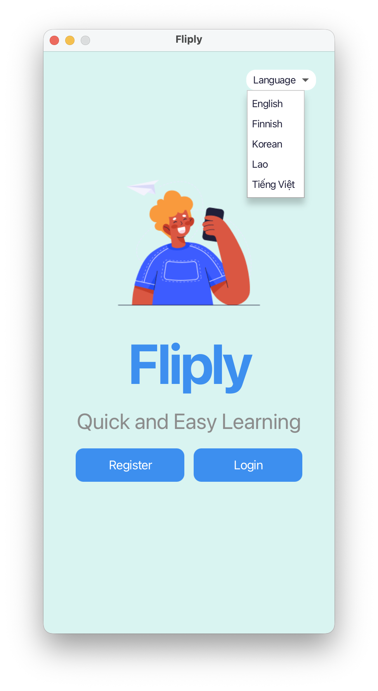
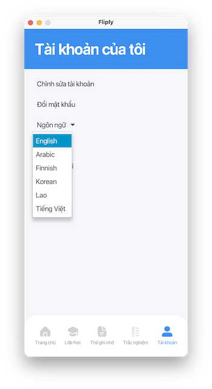
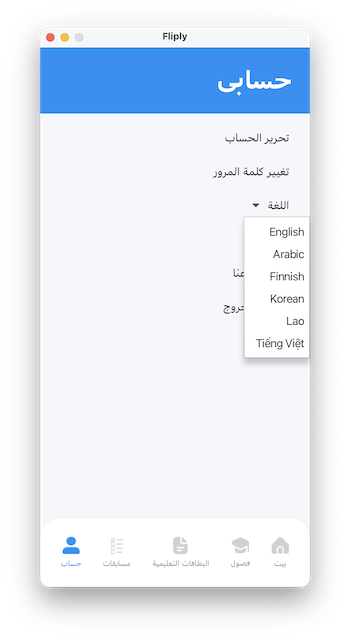
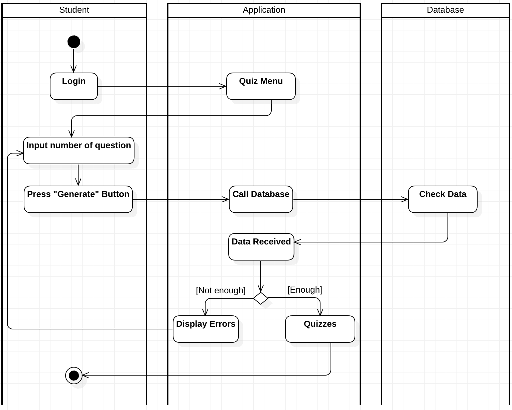
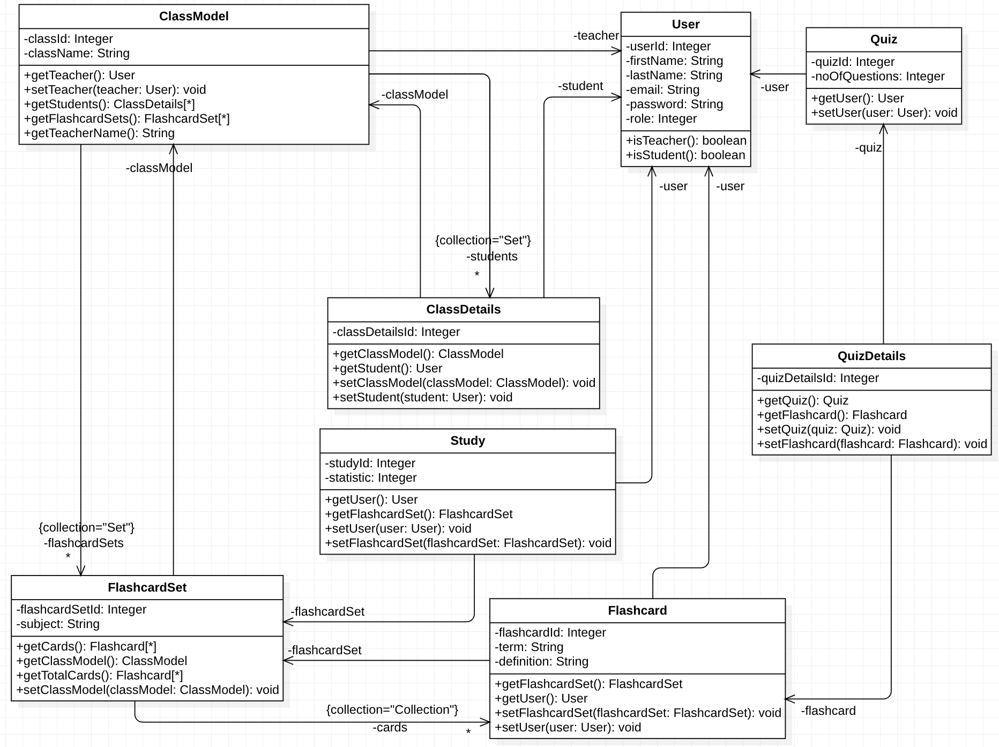
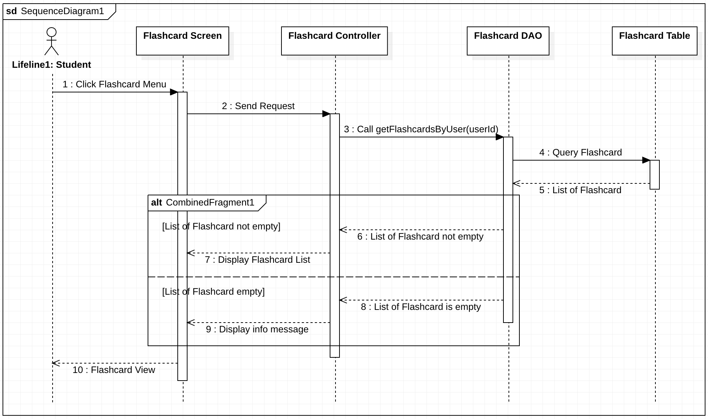

# Fliply

## Overview
Fliply is an online flashcard learning application for students and teachers. The system helps users create and manage flashcards, study with flashcard sets, take quizzes, join classrooms, and track learning progress in one place.

## Features
- User authentication
- Flashcard management
- Flashcard set management
- Study mode
- Quiz mode
- Classroom management
- Progress tracking
- Support multi-language (English, Arabic, Finnish, Korean, Lao, Vietnamese)

## Screens




## Diagrams
### Use Case Diagram


### ER Diagram


### Relational Schema


### Activity Diagram


### Class Diagram


### Sequence Diagram


## Technologies Used
- Java 21
- JavaFX
- Maven
- MariaDB
- JPA / Hibernate
- JUnit 5
- Mockito
- JaCoCo
- Docker
- Jenkins

## Repository
```
git clone https://github.com/nguyngc/fliply.git
```
## Trello Board
[https://trello.com/w/sep1_group3/home](https://trello.com/w/sep1_group3/home)

## Figma Design
[Fliply Prototype](https://www.figma.com/proto/vr1e9M1MRVlRu9v6x4GVHH/Untitled?node-id=1-2&p=f&t=KOn9wktxFwEu72ek-0&scaling=min-zoom&content-scaling=fixed&page-id=0%3A1&starting-point-node-id=1%3A2&show-proto-sidebar=1)

## Project Structure
```text
src/
├─ main/
│  ├─ java/
│  │  ├─ model/
│  │  ├─ view/
│  │  ├─ controller/
│  │  └─ util/
│  ├─ resources/
│  │  └─ META-INF/
│  │     └─ persistence.xml
│  └─ sql/
│     ├─ db_fliply.sql
│     └─ seed.sql
├─ test/
Dockerfile
Jenkinsfile
pom.xml
README.md
```

## Prerequisites
- Java 21
- Maven
- MariaDB
- Docker
- Jenkins

## Database Configuration
The project uses JPA with Hibernate and MariaDB.

- Persistence unit: `FliplyDbUnit`
- Database: `fliply`
- URL: `jdbc:mariadb://localhost:3306/fliply`
- Username: `appuser`
- Password: `password`
- Hibernate setting: `hibernate.hbm2ddl.auto=update`

## Database Setup
1. Make sure MariaDB is installed and running.
2. Create a database named `fliply`.
3. Create the user `appuser` and give it access to the `fliply` database.
4. Run the SQL scripts in `src/main/sql/` as needed (run `db_fliply.sql` to recreate the schema, then `seed.sql` to populate sample data).

Example SQL:

```sql
CREATE DATABASE fliply;
CREATE USER 'appuser'@'localhost' IDENTIFIED BY 'password';
GRANT ALL PRIVILEGES ON fliply.* TO 'appuser'@'localhost';
FLUSH PRIVILEGES;
```

## Authentication Flow
Fliply now authenticates users with email and password credentials (Google Sign-In has been removed). Create accounts through the UI or by running the database scripts in `src/main/sql/` (`db_fliply.sql` resets the schema, `seed.sql` inserts the sample accounts below):

| Role     | Email                   | Password |
|----------|-------------------------|----------|
| Teacher  | teacher1@example.com    | 123      |
| Teacher  | teacher2@example.com    | 123      |
| Student  | student1@example.com    | 123      |
| Student  | student2@example.com    | 123      |

Run `db_fliply.sql` followed by `seed.sql` whenever you need a clean database that already contains these starter accounts, and update the passwords immediately after first login if you retain these seed accounts in any shared environment.

## Build the Project
``` mvn clean install```

## Run the Application
Run with JavaFX Maven plugin:

``` mvn javafx:run```

Or run the `view.Main` class directly from your IDE.

## Run Tests
``` mvn test```

## Package Executable JAR
```mvn clean package```

The project uses the Maven Shade Plugin and the main class is `view.Main`.

## Run with Docker

### Build Docker image
```docker build -t fliply .```

### Run Docker container
```docker run --rm fliply```

### Docker Notes
- The Dockerfile uses a multi-stage build.
- Stage 1 builds the project with Maven and Java 21.
- Stage 2 runs the packaged JAR with JavaFX.
- JavaFX libraries are installed inside the container.
- The application runs with:
  - `javafx.controls`
  - `javafx.fxml`

### Important
Because Fliply is a JavaFX desktop application, running it in Docker may require an X server or GUI forwarding on your machine.

## Localization System
<details>

### 1. Language Management

Fliply uses a dedicated `Language` table to store all supported languages.  
Each language is identified by a unique language code (e.g., `en`, `vi`, `fi`), which is used for:

- Displaying available languages in the UI
- Selecting translations at runtime
- Referencing translations in other tables

#### **Language Table Structure**

| Column       | Description                                      |
|--------------|--------------------------------------------------|
| `id`         | Primary key                                      |
| `code`       | Language code (e.g., `"en"`)                     |
| `name`       | Human‑readable language name                     |
| `is_default` | Indicates the system fallback language           |

The language code is used both in the language menu and as a reference key for retrieving translations across the system.

---

### 2. Static UI Text Localization

Static UI text (e.g., button labels, menu items, system messages) is stored in the `LocalizationString` table.  
Each entry is identified by a unique key such as:

- `button.save`
- `ui.welcome`
- `error.notfound`

#### Excel‑Based Translation Import

All static translations are maintained in an Excel file located in the project’s `resources` directory.  
A Java `ImportService` reads this file and inserts or updates translations in the database.

This allows translators or non‑technical team members to update UI text without modifying code.

#### **LocalizationString Table Structure**

| Column        | Description                          |
|---------------|--------------------------------------|
| `id`          | Primary key                          |
| `key`         | Identifier for the UI text           |
| `language_id` | References `Language.id`             |
| `text`        | Translated text                      |

A unique constraint on `(key, language_id)` ensures that each key has only one translation per language.

---

### 3. Dynamic Content Localization

Dynamic content—such as class names, flashcard terms, and flashcard definitions—requires separate translation tables because these values vary per record.

Examples of translation tables:

- `Class_Translation`
- `FlashcardSet_Translation`
- `Flashcard_Translation`

#### **Translation Table Structure (General Pattern)**

| Column            | Description                                      |
|-------------------|--------------------------------------------------|
| `id`              | Primary key                                      |
| `<entity>_id`     | References the base table (e.g., `ClassId`)      |
| `language_id`     | References `Language.id`                         |
| `translated_value`| The translated text                              |

This structure allows the system to store translations for any number of languages without altering the base tables.

---

### 4. Runtime Localization Behavior

The system determines the active language and retrieves the appropriate translations at runtime.  
Localization behavior is divided into three components:  

|Content Type |	Storage	Retrieval |Method |	Fallback |
|-------------|-------------------|-------|-----------|
|Static UI Text |	LocalizationString|	Lookup by key + language|	Default language|
|Dynamic Content|	*_Translation tables|	Join base + translation table|	Base table value|
|Language Selection|	User profile or UI menu|	Determines active language|	System default|

#### 4.1 Language Selection

| Source            | Description |
|-------------------|-------------|
| **User Profile**  | Each user has a preferred language stored in the `USER` table. |
| **Language Menu** | Users may manually select a language in the UI. |
| **Default Language** | If a translation is missing, the system uses the language marked as `is_default = TRUE`. |

#### 4.2 Static Text Lookup

Static UI text is retrieved from the `LocalizationString` table using the text key and the active language code.

#### **SQL Query**

```
SELECT ls.text FROM LocalizationString ls
JOIN Language l ON l.id = ls.language_id
WHERE ls.key = :key AND l.code = :lang;
```
#### 4.3 Dynamic Content Lookup
Dynamic content is retrieved by joining the base table with its corresponding translation table.  
#### **SQL Query**
Example: Class Name Localization
```
SELECT c.ClassId, COALESCE(ct.name, c.ClassName) AS ClassName
FROM CLASS c
LEFT JOIN Class_Translation ct
ON ct.class_id = c.ClassId
AND ct.language_id = :langId;
```
</details>


