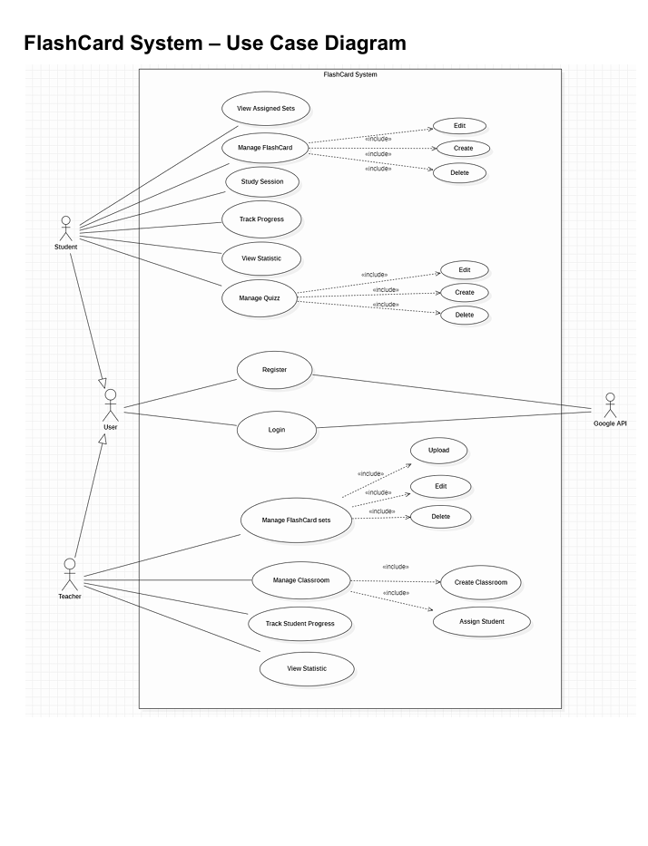
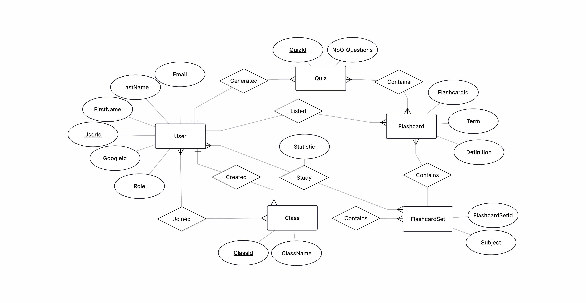
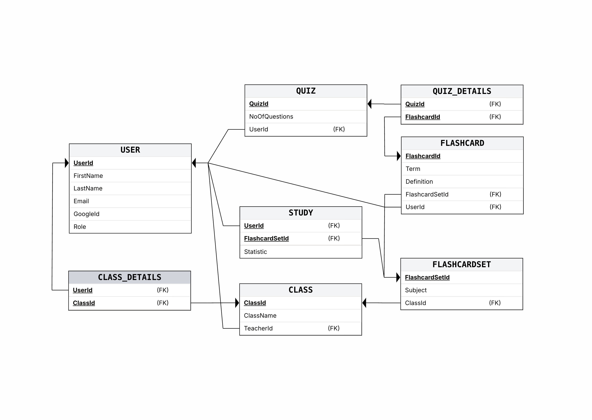

# Fliply

## Overview
Fliply is an online flashcard learning application for students and teachers. The system helps users create and manage flashcards, study with flashcard sets, take quizzes, join classrooms, and track learning progress in one place.

## Features
- User authentication
- Flashcard management
- Flashcard set management
- Study mode
- Quiz mode
- Classroom management
- Progress tracking
- Statistics


## Diagrams
### Use Case Diagram



### ER Diagram



### Relational Schema


## Technologies Used
- Java 21
- JavaFX
- Maven
- MariaDB
- JPA / Hibernate
- JUnit 5
- Mockito
- JaCoCo
- Docker
- Jenkins

## Repository
```
git clone https://github.com/nguyngc/fliply.git
```
## Trello Board
[https://trello.com/w/sep1_group3/home](https://trello.com/w/sep1_group3/home)

## Figma Design
[Fliply Prototype](https://www.figma.com/proto/vr1e9M1MRVlRu9v6x4GVHH/Untitled?node-id=1-2&p=f&t=KOn9wktxFwEu72ek-0&scaling=min-zoom&content-scaling=fixed&page-id=0%3A1&starting-point-node-id=1%3A2&show-proto-sidebar=1)

## Project Structure
```text
src/
├─ main/
│  ├─ java/
│  │  ├─ model/
│  │  ├─ view/
│  │  ├─ controller/
│  │  ├─ util/
│  │  └─ Main.java
│  ├─ resources/
│  │  └─ META-INF/
│  │     └─ persistence.xml
│  └─ sql/
│     ├─ db_fliply.sql
│     └─ seed.sql
├─ test/
Dockerfile
Jenkinsfile
pom.xml
README.md
```

## Prerequisites
- Java 21
- Maven
- MariaDB
- Docker
- Jenkins

## Database Configuration
The project uses JPA with Hibernate and MariaDB.

- Persistence unit: `FliplyDbUnit`
- Database: `fliply`
- URL: `jdbc:mariadb://localhost:3306/fliply`
- Username: `appuser`
- Password: `password`
- Hibernate setting: `hibernate.hbm2ddl.auto=update`

## Database Setup
1. Make sure MariaDB is installed and running.
2. Create a database named `fliply`.
3. Create the user `appuser` and give it access to the `fliply` database.
4. Run the SQL scripts in `src/main/sql/` as needed (run `db_fliply.sql` to recreate the schema, then `seed.sql` to populate sample data).

Example SQL:

```sql
CREATE DATABASE fliply;
CREATE USER 'appuser'@'localhost' IDENTIFIED BY 'password';
GRANT ALL PRIVILEGES ON fliply.* TO 'appuser'@'localhost';
FLUSH PRIVILEGES;
```

## Authentication Flow
Fliply now authenticates users with email and password credentials (Google Sign-In has been removed). Create accounts through the UI or by running the database scripts in `src/main/sql/` (`db_fliply.sql` resets the schema, `seed.sql` inserts the sample accounts below):

| Role     | Email                   | Password |
|----------|-------------------------|----------|
| Teacher  | teacher1@example.com    | 123      |
| Teacher  | teacher2@example.com    | 123      |
| Student  | student1@example.com    | 123      |
| Student  | student2@example.com    | 123      |

Run `db_fliply.sql` followed by `seed.sql` whenever you need a clean database that already contains these starter accounts, and update the passwords immediately after first login if you retain these seed accounts in any shared environment.

## Build the Project
``` mvn clean install```

## Run the Application
Run with JavaFX Maven plugin:

``` mvn javafx:run```

Or run the `Main` class directly from your IDE.

## Run Tests
``` mvn test```

## Package Executable JAR
```mvn clean package```

The project uses the Maven Shade Plugin and the main class is `Main`.

## Run with Docker

### Build Docker image
```docker build -t fliply .```

### Run Docker container
```docker run --rm fliply```

### Docker Notes
- The Dockerfile uses a multi-stage build.
- Stage 1 builds the project with Maven and Java 21.
- Stage 2 runs the packaged JAR with JavaFX.
- JavaFX libraries are installed inside the container.
- The application runs with:
  - `javafx.controls`
  - `javafx.fxml`

### Important
Because Fliply is a JavaFX desktop application, running it in Docker may require an X server or GUI forwarding on your machine.
