# Fliply

## Overview
Fliply is an online flashcard learning application for students and teachers. The system helps users create and manage flashcards, study with flashcard sets, take quizzes, join classrooms, and track learning progress in one place.

## Features
- User authentication
- Flashcard management
- Flashcard set management
- Study mode
- Quiz mode
- Classroom management
- Progress tracking
- Support multi-language (English, Arabic, Finnish, Korean, Lao, Vietnamese)

## Screens
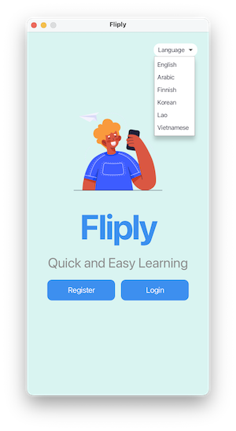
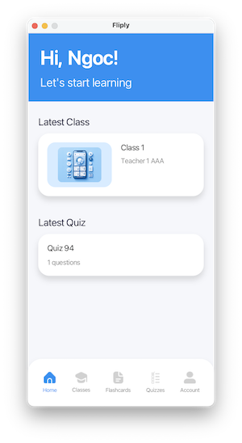
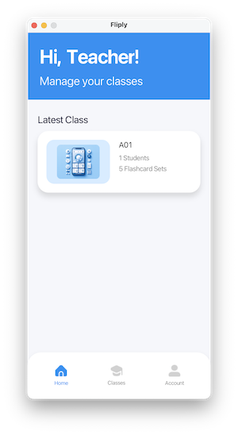
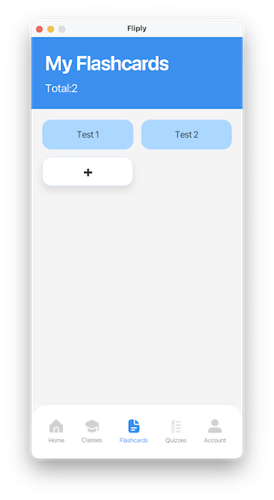
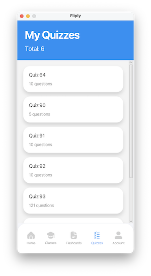
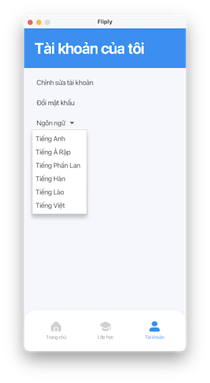
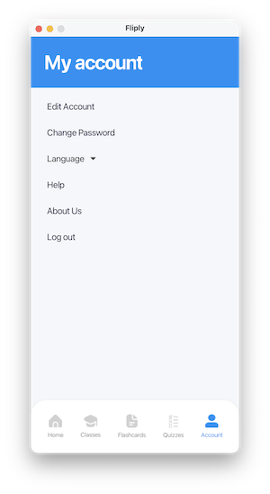
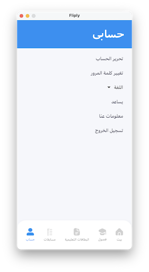

## Diagrams
### Use Case Diagram
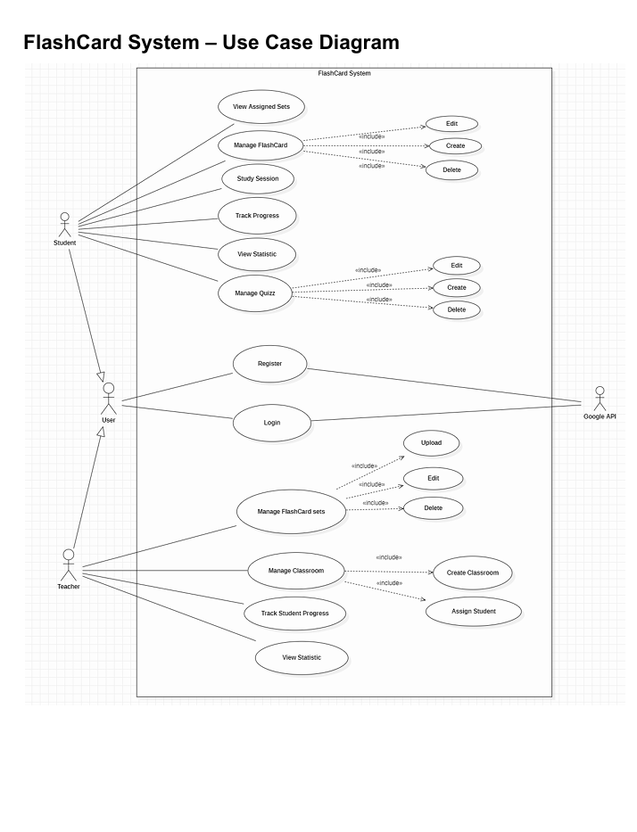

### ER Diagram
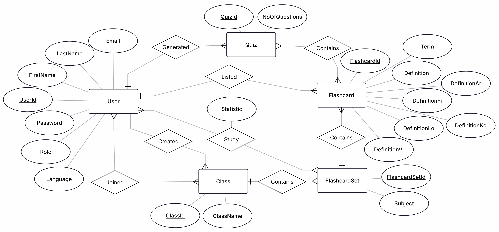

### Relational Schema
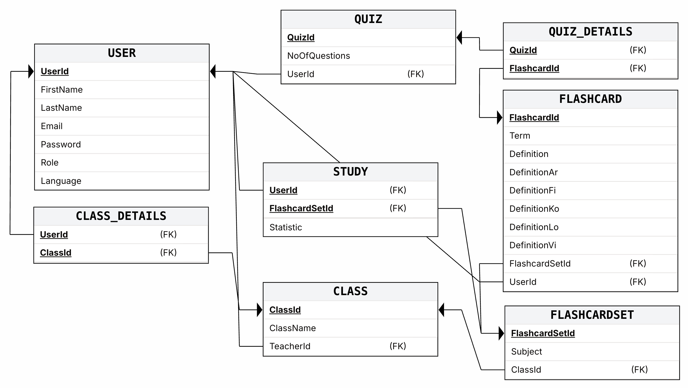

### Activity Diagram
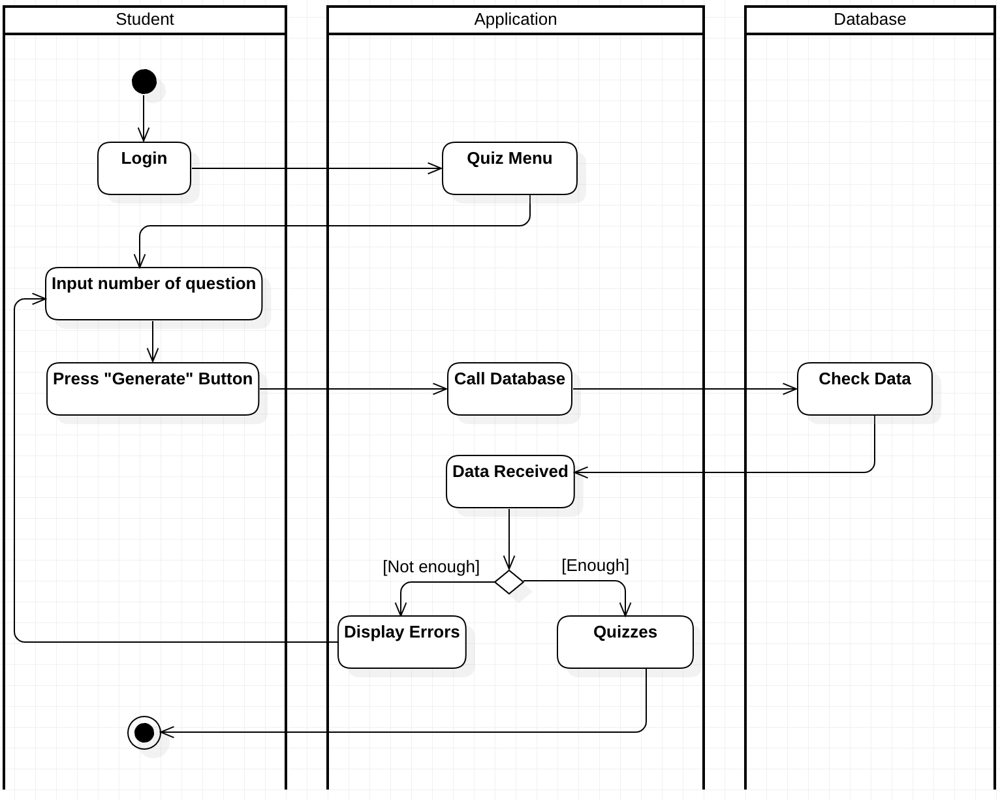

### Class Diagram
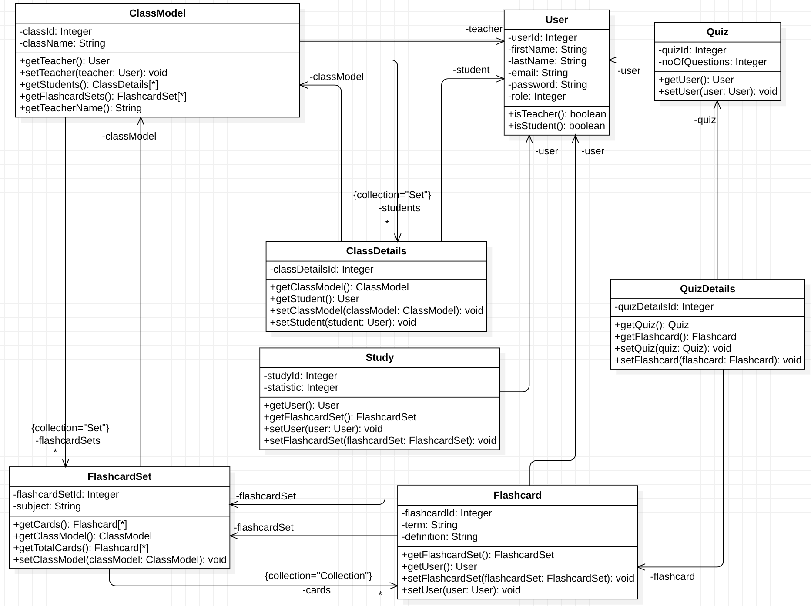

### Sequence Diagram
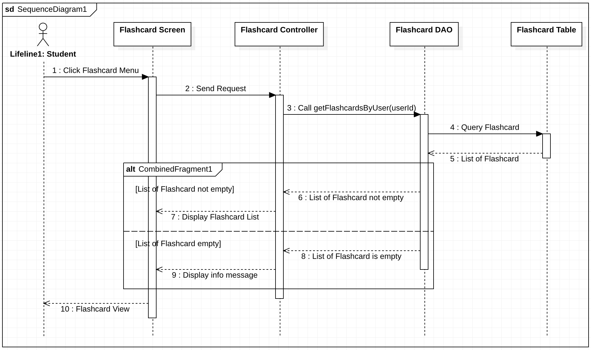

### Deployment Diagram
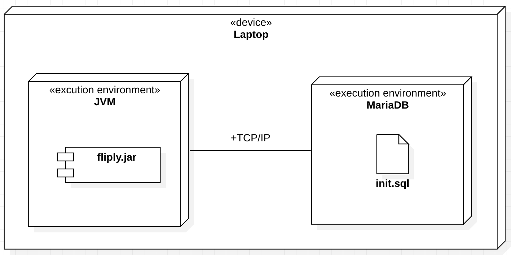

## Technologies Used
- Java 21
- JavaFX
- Maven
- MariaDB
- JPA / Hibernate
- JUnit 5
- Mockito
- JaCoCo
- Docker
- Jenkins

## Repository
```
git clone https://github.com/nguyngc/fliply.git
```
## Trello Board
[https://trello.com/w/sep1_group3/home](https://trello.com/w/sep1_group3/home)

## Figma Design
[Fliply Prototype](https://www.figma.com/proto/vr1e9M1MRVlRu9v6x4GVHH/Untitled?node-id=1-2&p=f&t=KOn9wktxFwEu72ek-0&scaling=min-zoom&content-scaling=fixed&page-id=0%3A1&starting-point-node-id=1%3A2&show-proto-sidebar=1)

## Project Structure
```text
src/
├─ main/
│  ├─ java/
│  │  ├─ model/
│  │  ├─ view/
│  │  ├─ controller/
│  │  └─ util/
│  ├─ resources/
│  │  └─ META-INF/
│  │     └─ persistence.xml
│  └─ sql/
│     ├─ db_fliply.sql
│     └─ seed.sql
├─ test/
Dockerfile
Jenkinsfile
pom.xml
README.md
```

## Prerequisites
- Java 21
- Maven
- MariaDB
- Docker
- Jenkins

## Database Configuration
The project uses JPA with Hibernate and MariaDB.

- Persistence unit: `FliplyDbUnit`
- Database: `fliply`
- URL: `jdbc:mariadb://localhost:3306/fliply`
- Username: `appuser`
- Password: `password`
- Hibernate setting: `hibernate.hbm2ddl.auto=update`

## Database Setup
1. Make sure MariaDB is installed and running.
2. Create a database named `fliply`.
3. Create the user `appuser` and give it access to the `fliply` database.
4. Run the SQL scripts in `src/main/sql/` as needed (run `db_fliply.sql` to recreate the schema, then `seed.sql` to populate sample data).

Example SQL:

```sql
CREATE DATABASE fliply;
CREATE USER 'appuser'@'localhost' IDENTIFIED BY 'password';
GRANT ALL PRIVILEGES ON fliply.* TO 'appuser'@'localhost';
FLUSH PRIVILEGES;
```

## Authentication Flow
Fliply now authenticates users with email and password credentials (Google Sign-In has been removed). Create accounts through the UI or by running the database scripts in `src/main/sql/` (`db_fliply.sql` resets the schema, `seed.sql` inserts the sample accounts below):

| Role     | Email                   | Password |
|----------|-------------------------|----------|
| Teacher  | teacher1@example.com    | 123      |
| Teacher  | teacher2@example.com    | 123      |
| Student  | student1@example.com    | 123      |
| Student  | student2@example.com    | 123      |

Run `db_fliply.sql` followed by `seed.sql` whenever you need a clean database that already contains these starter accounts, and update the passwords immediately after first login if you retain these seed accounts in any shared environment.

## Build the Project
``` mvn clean install```

## Run the Application
Run with JavaFX Maven plugin:

``` mvn javafx:run```

Or run the `view.Main` class directly from your IDE.

## Run Tests
``` mvn test```

## Package Executable JAR
```mvn clean package```

The project uses the Maven Shade Plugin and the main class is `view.Main`.

## Run with Docker

### Build Docker image
```docker build -t fliply .```

### Run Docker container
```docker run --rm fliply```

### Docker Notes
- The Dockerfile uses a multi-stage build.
- Stage 1 builds the project with Maven and Java 21.
- Stage 2 runs the packaged JAR with JavaFX.
- JavaFX libraries are installed inside the container.
- The application runs with:
  - `javafx.controls`
  - `javafx.fxml`

### Important
Because Fliply is a JavaFX desktop application, running it in Docker may require an X server or GUI forwarding on your machine.

## Localization System
<details>

Fliply currently supports six languages:

| Language | Code | Locale |
|----------|------|--------|
| English | `en` | `en_US` |
| Arabic | `ar` | `ar_AR` |
| Finnish | `fi` | `fi_FI` |
| Korean | `ko` | `ko_KR` |
| Lao | `lo` | `lo_LA` |
| Vietnamese | `vi` | `vi_VN` |

### 1. Active Language

The active language is managed in `util.LocaleManager`.

- English is the default language.
- The account language menu lets users switch language.
- The selected language code is saved in the `USER.Language` column.
- Login applies the stored user language with `LocaleManager.setLocaleByLanguage(...)`.
- Logout resets the application language back to English.

#### `USER` Language Field

| Column | Description |
|--------|-------------|
| `Language` | Two-letter language code, for example `en`, `vi`, or `lo` |

### 2. Static UI Text

Static UI text is stored in Java resource bundle files under `src/main/resources`.

| File | Purpose |
|------|---------|
| `Messages.properties` | Default fallback bundle |
| `Messages_en_US.properties` | English UI text |
| `Messages_ar_AR.properties` | Arabic UI text |
| `Messages_fi_FI.properties` | Finnish UI text |
| `Messages_ko_KR.properties` | Korean UI text |
| `Messages_lo_LA.properties` | Lao UI text |
| `Messages_vi_VN.properties` | Vietnamese UI text |

FXML files use resource keys directly, for example:

```xml
<Button text="%account.logout"/>
<MenuButton text="%language.current"/>
```

Controllers that set text in Java load the same bundle through `ResourceBundle`, `I18n`, or `LocalizationService`.

### 3. Screen Reload Behavior

When a user changes language, the app updates `LocaleManager` and reloads the current screen through `Navigator.reloadCurrent()`. `Navigator` loads FXML with:

```java
ResourceBundle.getBundle("Messages", LocaleManager.getLocale())
```

This lets JavaFX resolve all `%key` values again using the selected language.

### 4. Text Direction and Fonts

- Arabic is displayed right-to-left through `Navigator.applyTextDirection(...)`.
- Lao applies a dedicated font/style hook so Lao glyphs render consistently.
- Vietnamese and Lao message files must not contain a UTF-8 BOM before the first key, otherwise Java treats the first key as a different string.

### 5. Localized Flashcard Definitions

Flashcard terms remain shared across languages, but definitions can now be stored in every supported language.

#### `FLASHCARD` Definition Fields

| Column | Language |
|--------|----------|
| `Definition` | English fallback |
| `DefinitionAr` | Arabic |
| `DefinitionFi` | Finnish |
| `DefinitionKo` | Korean |
| `DefinitionLo` | Lao |
| `DefinitionVi` | Vietnamese |

When a student opens flashcard details, `FlashcardDetailController` uses the current user's language:

```java
flashcard.getLocalizedDefinition(currentUser.getLanguage())
```

If the requested localized definition is missing or blank, the app falls back to the English `Definition` value.

### 6. Teacher CSV Upload Format

Teachers can upload flashcard sets with definitions in all supported languages. The import parser accepts `.csv`, `.tsv`, `.psv`, and `.pipe` files.

Recommended CSV header:

```csv
Term,English,Arabic,Finnish,Korean,Lao,Vietnamese
```

Example:

```csv
CPU,Central Processing Unit,وحدة المعالجة المركزية,Keskusyksikkö,중앙 처리 장치,ໜ່ວຍປະມວນຜົນກາງ,Bộ xử lý trung tâm
```

The older two-column format still works:

```csv
Term,Definition
CPU,Central Processing Unit
```

In that case, only the English fallback definition is stored.

### 7. Teacher Inline Editing

When a teacher opens a flashcard set and edits a card, the inline editor now provides separate fields for:

- English definition
- Arabic definition
- Finnish definition
- Korean definition
- Lao definition
- Vietnamese definition

English is required because it is the fallback definition. The other language fields are optional.
</details>


