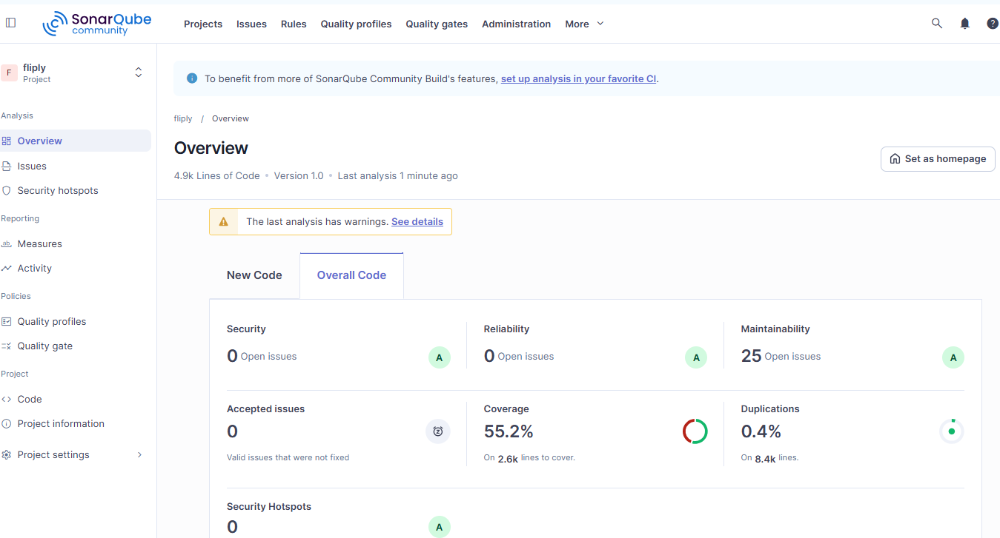

# Fliply

## 1. Project Title & Overview
Fliply is a JavaFX desktop application that supports flashcard learning, quiz generation, classroom management, and multilingual study content in one place. It was built to solve the problem of scattered learning workflows for students and teachers, where study material, progress, and class resources are often managed in separate tools. The application uses Java 21, JavaFX, Maven, MariaDB, JPA/Hibernate, JUnit 5, Mockito, JaCoCo, Docker, and Jenkins. It supports English, Arabic, Finnish, Korean, Lao, and Vietnamese user interfaces. The project was delivered over eight 2-week sprints, for a total duration of 16 weeks. All diagrams, screenshots, and sprint documents are referenced in section 12 below.

## 2. Product Vision
**Vision statement:** Build a lightweight but structured learning platform where teachers publish study material and students practice it through flashcards, quizzes, and classroom-based content.

**Main goals**
- Provide a single system for creating, studying, and reviewing learning material.
- Support both student and teacher workflows with clear role-based screens.
- Deliver a localized user interface for multiple languages.
- Keep the application testable, maintainable, and easy to deploy.

**Key features**
- User authentication and account management
- Flashcard and flashcard-set management
- Quiz generation and quiz result tracking
- Classroom management for teachers and students
- Multilingual UI and localized learning content

**Definition of success**
The project is considered complete when the core workflows work reliably, automated tests pass, localization is available, the main technical documents are finished, and the final product can be built and run reproducibly.

## 3. Project Plan & Sprint Structure
Fliply was developed using an Agile/Scrum approach with 2-week sprints. Each sprint focused on one major part of the system, from initial planning to final documentation and quality assurance.

| Sprint | Goal |
|---|---|
| Sprint 1 | Project planning, vision, scope, backlog, and risk definition |
| Sprint 2 | Functional requirements, use cases, and database design |
| Sprint 3 | JavaFX UI implementation and CI pipeline setup |
| Sprint 4 | Docker containerization and reproducible runtime setup |
| Sprint 5 | UI localization and language support |
| Sprint 6 | Database localization and acceptance testing preparation |
| Sprint 7 | Quality assurance, static analysis, and test stabilization |
| Sprint 8 | Final documentation, consolidation, and repository finalization |

## 4. Sprint 1 – Project Planning & Vision
Sprint 1 defined the project direction, scope, backlog, and delivery plan. The team validated the product vision, documented risks, and created the initial project backlog.

- Planning report: [`Sprint_1_Planning_Report.md`](documents/Sprint%201/Sprint_1_Planning_Report.md)
- Review report: [`Sprint_1_Review_Report.md`](documents/Sprint%201/Sprint_1_Review_Report.md)
- Supporting documents: [`Product Vision`](documents/Sprint%201/Product_Vision.pdf), [`Project Plan`](documents/Sprint%201/Project_Plan.pdf), [`Product Backlog`](documents/Sprint%201/Product_Backlog.pdf)

## 5. Sprint 2 – Requirements & Database
Sprint 2 focused on functional requirements, use cases, and database design. The system data model was defined with MariaDB and JPA/Hibernate, and the ER diagram and relational schema were finalized.

- Planning report: [`Sprint_2_Planning_Report.md`](documents/Sprint%202/Sprint_2_Planning_Report.md)
- Review report: [`Sprint_2_Review_Report.md`](documents/Sprint%202/Sprint_2_Review_Report.md)
- Database implementation: MariaDB + JPA/Hibernate with schema and seed scripts under `src/main/sql/`
- Unit testing strategy: JUnit 5 and Mockito, with H2 used for isolated test execution

## 6. Sprint 3 – UI Implementation & CI
Sprint 3 delivered the first JavaFX screens and controller structure. The UI was implemented with FXML, and the CI pipeline was prepared to build, test, and measure coverage automatically.

- Planning report: [`Sprint_3_Planning_Report.md`](documents/Sprint%203/Sprint_3_Planning_Report.md)
- Review report: [`Sprint_3_Review_Report.md`](documents/Sprint%203/Sprint_3_Review_Report.md)
- UI framework: JavaFX with FXML-based screens and controller classes
- Typical screens: welcome, login, register, home, flashcards, quizzes, classes, and account
- Jenkins pipeline: automated build, test execution, and coverage reporting with JaCoCo

## 7. Sprint 4 – Docker Containerization
Sprint 4 introduced Docker-based delivery so the application and database could be run in a reproducible environment. This improved consistency between development, testing, and deployment.

- Planning report: [`Sprint_4_Planning_Report.md`](documents/Sprint%204/Sprint_4_Planning_Report.md)
- Review report: [`Sprint_4_Review_Report.md`](documents/Sprint%204/Sprint_4_Review_Report.md)
- Containerized services: the Fliply application and MariaDB database
- Docker setup: [`Dockerfile`](Dockerfile) and [`docker-compose.yml`](docker-compose.yml)
- Development/testing use: consistent local environments and repeatable container-based execution

## 8. Sprint 5 – UI Localization & Kubernetes
Sprint 5 focused on multilingual UI support and locale switching. The application uses resource bundles and a stored user language preference to reload screens in the selected locale. Kubernetes was not used in the final delivery; Docker remained the deployment approach.

- Planning report: [`Sprint_5_Planning_Report.md`](documents/Sprint%205/Sprint_5_Planning_Report.md)
- Review report: [`Sprint_5_Review_Report.md`](documents/Sprint%205/Sprint_5_Review_Report.md)
- Supported UI languages: English, Arabic, Finnish, Korean, Lao, and Vietnamese
- Localization approach: Java resource bundle files and locale-aware screen reloads
- Kubernetes: not applied in the final product; containerization is handled with Docker and Docker Compose

## 9. Sprint 6 – Database Localization
Sprint 6 extended localization into the data layer so flashcard definitions could be stored and shown in multiple languages. Validation and acceptance planning were also completed for the localized workflows.

- Planning report: [`Sprint_6_Planning_Report.md`](documents/Sprint%206/Sprint_6_Planning_Report.md)
- Review report: [`Sprint_6_Review_Report.md`](documents/Sprint%206/Sprint_6_Review_Report.md)
- Language-specific data handling: localized flashcard definition fields and fallback behavior
- Database and import updates: schema and CSV import support for multilingual content
- Validation approach: check localized fields during create/edit/import workflows

## 10. Sprint 7 – Quality Assurance
Sprint 7 was dedicated to quality assurance, code analysis, usability evaluation, and bug fixing. This sprint covered SonarQube analysis, unit testing, functional testing, heuristic evaluation, and UAT preparation.

- Planning report: [`Sprint_7_Planning_Report.md`](documents/Sprint%207/Sprint_7_Planning_Report.md)
- Review report: [`Sprint_7_Review_Report.md`](documents/Sprint%207/Sprint_7_Review_Report.md)
- SonarQube usage: static analysis, issue tracking, and code-quality review
- Quality tools: JaCoCo coverage, JUnit 5, Mockito, and Jenkins build verification
- Testing scope: functional testing, non-functional checks, heuristic evaluation, and UAT documentation

## 11. Sprint 8 – Documentation & Finalization
Sprint 8 consolidated the final technical documentation and repository structure. The final README, documentation index, and architecture references were organized so the repository is easy to navigate.

- Final repository README: this file
- API documentation: not applicable, because Fliply is a desktop JavaFX application and does not expose a public HTTP API
- Final system architecture diagram: linked below under diagrams
- Outcome: the repository now provides a clear entry point for reports, diagrams, screenshots, and final technical references

## 12. Documentation Hub

### Sprint Reports

| Sprint | Planning | Review | Notes |
|---|---|---|---|
| Sprint 1 | [Planning](documents/Sprint%201/Sprint_1_Planning_Report.md) | [Review](documents/Sprint%201/Sprint_1_Review_Report.md) | Vision, backlog, scope, and risk planning |
| Sprint 2 | [Planning](documents/Sprint%202/Sprint_2_Planning_Report.md) | [Review](documents/Sprint%202/Sprint_2_Review_Report.md) | Requirements and database design |
| Sprint 3 | [Planning](documents/Sprint%203/Sprint_3_Planning_Report.md) | [Review](documents/Sprint%203/Sprint_3_Review_Report.md) | UI implementation and CI |
| Sprint 4 | [Planning](documents/Sprint%204/Sprint_4_Planning_Report.md) | [Review](documents/Sprint%204/Sprint_4_Review_Report.md) | Docker containerization |
| Sprint 5 | [Planning](documents/Sprint%205/Sprint_5_Planning_Report.md) | [Review](documents/Sprint%205/Sprint_5_Review_Report.md) | Localization and database-language support |
| Sprint 6 | [Planning](documents/Sprint%206/Sprint_6_Planning_Report.md) | [Review](documents/Sprint%206/Sprint_6_Review_Report.md) | Acceptance testing and localization validation |
| Sprint 7 | [Planning](documents/Sprint%207/Sprint_7_Planning_Report.md) | [Review](documents/Sprint%207/Sprint_7_Review_Report.md) | Quality assurance, SonarQube, and testing |

### Diagrams

| Diagram | File |
|---|---|
| Use Case Diagram | [UseCase.png](documents/Diagrams/UseCase.png) / [PDF](documents/Diagrams/UseCase%20Diagram.pdf) |
| ER Diagram | [ERDiagram.png](documents/Diagrams/ERDiagram.png) |
| Relational Schema | [RelationalSchema.png](documents/Diagrams/RelationalSchema.png) |
| Activity Diagram – Generate Quiz | [ActivityDiagram-GenerateQuiz.png](documents/Diagrams/ActivityDiagram-GenerateQuiz.png) |
| Activity Diagram – Manage Flashcards | [Activity Diagram-Manage Flashcards.png](documents/Diagrams/Activity%20Diagram-Manage%20Flashcards.png) |
| Class Diagram | [ClassDiagram.png](documents/Diagrams/ClassDiagram.png) |
| Sequence Diagram | [SequenceDiagram.png](documents/Diagrams/SequenceDiagram.png) |
| Deployment Diagram | [DeploymentDiagram.png](documents/Diagrams/DeploymentDiagram.png) |
| User Journey Map | [UserJourneyMap.png](documents/Diagrams/UserJourneyMap.png) |


### Screenshots and Images

<table>
  <tr>
    <td align="center">
      
      <br><strong>Welcome Screen</strong>
    </td>
    <td align="center">
      
      <br><strong>Home Screen – Student</strong>
    </td>
    <td align="center">
      
      <br><strong>Home Screen – Teacher</strong>
    </td>
  </tr>
  <tr>
    <td align="center">
      
      <br><strong>Flashcard Screen</strong>
    </td>
    <td align="center">
      
      <br><strong>Quiz Screen</strong>
    </td>
    <td align="center">
      
      <br><strong>Account – English</strong>
    </td>
  </tr>
  <tr>
    <td align="center">
      
      <br><strong>Account – Localized View</strong>
    </td>
    <td align="center">
      
      <br><strong>Account – RTL</strong>
    </td>
    <td align="center">
      
      <br><strong>SonarQube Report</strong>
    </td>
  </tr>
  <tr>
    <td align="center" colspan="3">
      
      <br><strong>Unit Test Evidence</strong>
    </td>
  </tr>
</table>

### Supporting Documents

| Document | File |
|---|---|
| Product Vision | [Product_Vision.pdf](documents/Sprint%201/Product_Vision.pdf) |
| Product Backlog | [Product_Backlog.pdf](documents/Sprint%201/Product_Backlog.pdf) |
| Project Plan | [Project_Plan.pdf](documents/Sprint%201/Project_Plan.pdf) |
| SEP1 Project Report | [SEP1 - Project Fliply.pdf](documents/Sprint%204/SEP1%20-%20Project%20Fliply.pdf) |
| Localization Workbook | [Fliply-Localization.xlsx](documents/Sprint%205/Fliply-Localization.xlsx) |
| Database Localization Plan | [Database localization plan report.pdf](documents/Sprint%206/Database%20localization%20plan%20report.pdf) |
| Acceptance Test Planning | [Sprint 6 Acceptance Test Planning.pdf](documents/Sprint%206/Sprint%206%20Acceptance%20Test%20Planning.pdf) |
| Statistical Code Review | [Statistical_Code_Review.pdf](documents/Sprint%206/Statistical_Code_Review.pdf) |
| Heuristic Evaluation | [Heuristic Evaluation Table.pdf](documents/Sprint%207/Heuristic%20Evaluation%20Table.pdf) |
| Test Plan | [TestPlan.pdf](documents/Sprint%207/TestPlan.pdf) |
| Acceptance Test Cases | [Test case.xlsx](documents/Sprint%207/Test%20case.xlsx) |

## 13. How to Run the Project

### Prerequisites
- Java 21
- Maven 3.9+
- MariaDB 11+ or Docker
- Git

### Database configuration
- Persistence unit: `FliplyDbUnit`
- Database name: `fliply`
- JDBC URL: `jdbc:mariadb://localhost:3306/fliply`
- Username: `appuser`
- Password: `password`
- Hibernate setting: `hibernate.hbm2ddl.auto=update`

### Database setup
1. Start MariaDB locally or use Docker Compose.
2. Create the `fliply` database and the `appuser` account if you run MariaDB manually.
3. For a clean local database, run `src/main/sql/db_fliply.sql` first and then `src/main/sql/seed.sql`.
4. The Docker Compose database service uses `sql/init.sql` for container initialization.

Sample seed accounts:

| Role | Email | Password |
|---|---|---|
| Teacher | teacher1@example.com | 123 |
| Teacher | teacher2@example.com | 123 |
| Student | student1@example.com | 123 |
| Student | student2@example.com | 123 |

### Local setup
```bash
git clone https://github.com/nguyngc/fliply.git
cd fliply
```

Start the database locally or use the bundled Docker database service. For a local MariaDB setup, create the database and user described below.

### Run with Maven
```bash
mvn clean install
mvn javafx:run
```

### Run with Docker Compose
```bash
docker compose up --build
```

The Docker setup starts the MariaDB container and the application container. Because Fliply is a JavaFX desktop application, your machine may need GUI forwarding or an X server for the window to appear.

### Access the application
- When run locally, the JavaFX window opens on the desktop.
- When run in Docker, use the display/GUI forwarding configuration required by your platform.

## 14. Testing Instructions

### Unit tests
```bash
mvn test
```

### Coverage report
```bash
mvn verify
```

After `verify`, open the JaCoCo report at:
- `target/site/jacoco/index.html`

### Performance testing
No dedicated JMeter test suite was delivered in the final repository. The final QA scope focused on functional testing, non-functional checks, and static analysis.

## 15. Repository Structure

| Path | Description |
|---|---|
| `src/main/java` | Application source code: controllers, services, entities, DAO, utilities, and views |
| `src/main/resources` | FXML files, resource bundles, and persistence configuration |
| `src/test/java` | Unit and integration test sources (JUnit 5 + Mockito) |
| `src/test/resources` | Test resources and test-specific resource bundles |
| `src/main/sql` | Database schema and seed scripts |
| `sql` | Docker initialization SQL used by the compose setup |
| `documents` | Documentation hub, sprint reports, diagrams, screenshots, and supporting files |
| `Dockerfile` | Docker image definition for the application |
| `docker-compose.yml` | Multi-service local container setup for app and database |
| `Jenkinsfile` | CI pipeline definition |
| `pom.xml` | Maven build, test, coverage, and packaging configuration |
| `target` | Build output generated by Maven |
| `target/surefire-reports` | Test execution reports generated by Maven Surefire/Failsafe |
| `target/site/jacoco` | Coverage report produced by JaCoCo (open index.html) |

## 16. Authors

| Team member | Role               |
|---|--------------------|
| Ngoc Nguyen | Developer / tester |
| Thanh Nguyen | Developer / tester |
| Nhut Vo | Developer / tester |
| Hoang Vu | Developer / tester |

**Course:** Software Project 1 & 2, Spring 2026  
**Semester:** Spring 2026
