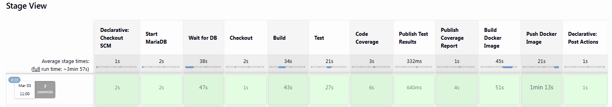
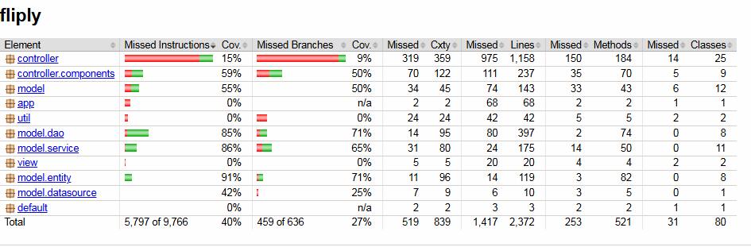
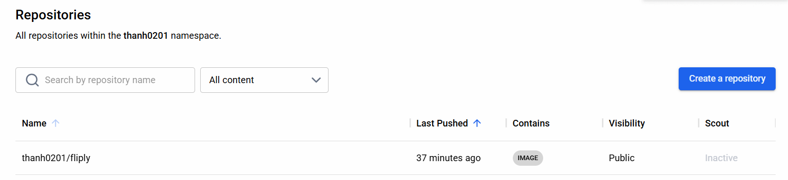
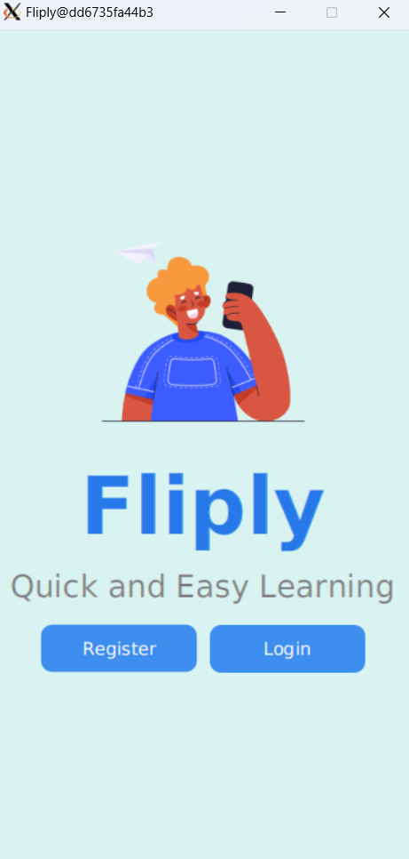

# Sprint 3 Review Report

1. Sprint Goal
The goal of Sprint 3 was to extend the existing prototype, set up and demonstrate a fully functional Jenkins CI/CD pipeline, improve code quality through unit testing and code coverage, and build a Docker image that runs successfully in a local environment.

---

2. Completed User Stories / Tasks
- Extended and refined the functional prototype with additional features.
- Set up a Jenkins CI/CD pipeline including build, test execution, and automated report generation.
- Increased code coverage and generated updated JaCoCo reports.
- Built and successfully ran the application using a Docker image on a local machine.
- Updated project documentation, Jenkins configuration, and Docker-related files.
- Updated GitHub repository with the latest code and documentation.
- Updated Trello/Jira boards to reflect completed and remaining tasks.
- Collected evidence of individual contributions (commit logs, task assignments, meeting notes).

---

3. Demo Summary
During the Sprint Review, the team demonstrated:
- A fully working prototype with newly extended features.
- The Jenkins CI/CD pipeline running end-to-end: build → test → coverage report generation.  
  
- The updated code coverage report, highlighting well-tested areas and parts needing further improvement.  
  
- A working Docker image running locally, confirming the application operates correctly inside a container.
  
  
- Updated GitHub and Trello/Jira boards showing the progress made during Sprint 3.

---

4. What Went Well
- The CI/CD pipeline has been successfully established.
- Code coverage improved significantly compared to previous sprints.
- Team communication and task coordination were effective.
- The prototype performed smoothly during the demonstration.

---

5. What Could Be Improved
- Some complex logic paths still require additional test cases.
- Jenkins pipeline execution time could be optimized.
- Docker image size can be reduced in future iterations.
- Meeting notes and documentation could be more detailed for easier tracking.

---

6. Next Sprint Focus
- Continue extending features based on the product backlog.
- Further improve code quality and increase test coverage.
- Optimize the Dockerfile to reduce image size.
- Enhance the CI/CD pipeline with additional quality checks (e.g., linting).
- Prepare for Sprint 4.

---

7. Team Time Contribution

| Team Member  | Time Spent (Hours) | Main Contributions                                                                                                                           |  
|--------------|--------------------|----------------------------------------------------------------------------------------------------------------------------------------------|
| Ngoc Nguyen  | 24                 | All UI design files and all controller files that have not yet been connected to the backend and frontend.                                   |
| Thanh Nguyen | 45                 | Master scrum, CI/CD, Update all files associated with the Home, Classes, and Account menus, integrating the backend and frontend components. | 
| Nhut Vo      | 15                 | Update all files associated with the Quizzes menu, Register user, integrating the backend and frontend components.                           |
| Hoang Vu     | 10                 | Update all files associated with the Flashcards menu, integrating the backend and frontend components.                                       |
| **Total**    | ** 99 **           |                                                                                                                                              | 

