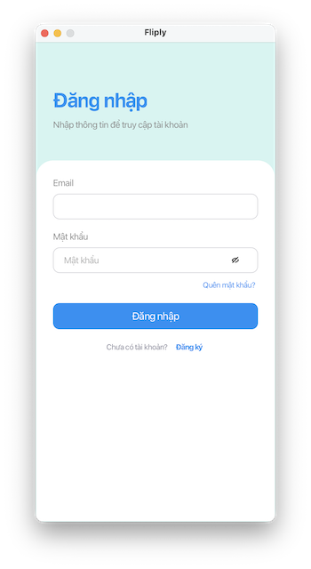
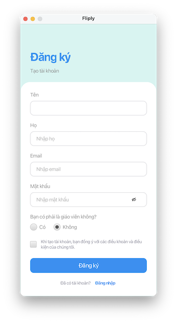
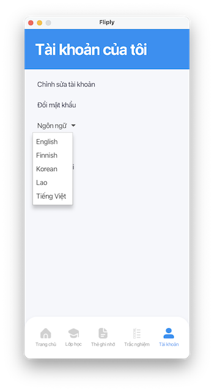

# Sprint Review Report

## Sprint Number & Dates
**Sprint 5**  
**Duration:** 2 weeks (18/03/2026 - 31/03/2026)  
**Scrum Master:** Ngoc Nguyen

## Sprint Goal
The goal of Sprint 5 is to prepare the **Online Flashcard System for Study** for full multilingual support by implementing user interface (UI) localization. This includes externalizing UI text, enabling language selection, supporting multiple languages (including non-Latin), updating backlog items, and ensuring proper documentation and system readiness for future localization scalability.

## Completed User Stories / Tasks
- Identified and documented all translatable UI elements
- Refactored UI to externalize static text into resource bundles
- Implemented language resource files (.properties)
- Added language selection on Welcome and Account pages
- Implemented dynamic language switching (UI reload)
- Added support for multiple languages including non-Latin (e.g., Korean, Lao)
- Adjusted UI layouts to support longer multilingual text
- Updated product backlog with localization-related user stories
- Updated GitHub README with localization instructions and new diagram (activity, class)
- Tested localization functionality across different screens

## Demo Summary
- Demonstration of language selection on Welcome page
- Switching language from Account page
- Dynamic UI updates without restarting the application
- Display of multiple languages including non-Latin scripts
- GitHub documentation update (README localization section with screen and new Activity/Class Diagram)

   

## What Went Well
- Successful implementation of dynamic language switching
- Good team collaboration and task distribution
- UI successfully adapted to multilingual content
- Non-Latin language support working correctly
- Documentation and README updated clearly 

## What Could Be Improved
- More consistent styling across all localized screens
- Additional testing for edge cases (very long translations)
- Improve time estimation for UI adjustments

## Next Sprint Focus
- Improve UI/UX consistency for multilingual layouts
- Improve performance and responsiveness
- Conduct more user testing and feedback collection

## Time Spent by Team Members

| Team Member  | Main Contributions                                                                                                                                                                                                                | Time Spent (Hours) | In-class tasks |
|--------------|-----------------------------------------------------------------------------------------------------------------------------------------------------------------------------------------------------------------------------------|--------------------|----------------|
| Ngoc Nguyen  | - Update product backlog - Add language Selection Feature, Dynamic UI update - Identify Translatable Elements and Localize UI (Welcome page, Flashcard Sets) - Update README.md - Prepare Sprint 5 Review Report. | 12                 | Submitted      |
| Thanh Nguyen | - Identify Translatable Elements and Localize UI (Login, Account management, Classes management) - Prepare Sprint 6 Planning Report                                                                                           | 7                  | Submitted      |
| Nhut Vo      | Identify Translatable Elements and Localize UI (Quizz and Register Page), fixing UI format conflict                                                                                                                               | 8                  | Submitted      |
| Hoang Vu     | Identify Translatable Elements and Localize UI (Flashcard page)                                                                                                                                                                   | 4                  | Submitted      |
| **Total**    |                                                                                                                                                                                                                                   | **31**             |                |
