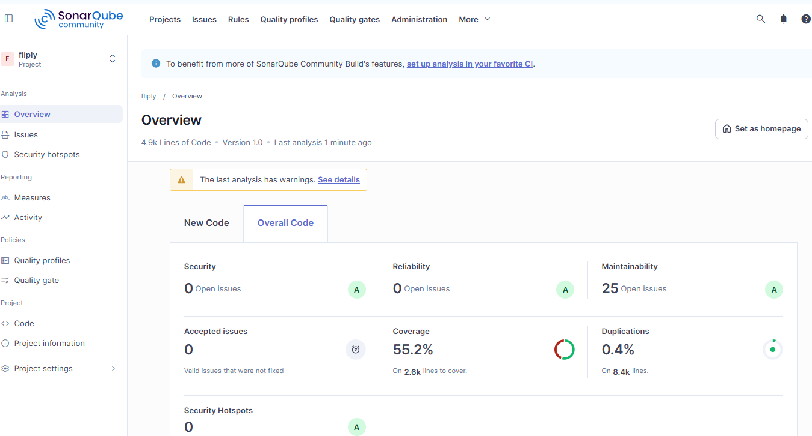

# Sprint Review Report

## Sprint Number & Dates
**Sprint 6**  
**Duration:** 2 weeks (01/04/2026 - 15/04/2026)  
**Scrum Master:** Thanh Nguyen

## Sprint Goal
Extend localization support into the database layer while improving overall code quality, maintainability, and readiness for acceptance testing.  
This sprint focuses on implementing multilingual database structures, performing systematic code review, refactoring the codebase, and designing acceptance test plans.

## Completed User Stories / Tasks
1. Database Localization
- Add Arabic language(RTL)
- Add new field to User table(language)
- Update entity, dao, controller
- Database localization planning
2. Statistical Code Review
- Setup and run SonarQube-Scanner
- Statistical code review 
3. Code Clean-Up and Refactoring
- Increase the coverage of UT
- Fix duplicates
4. Acceptance Test Planning
- Acceptance test planning report
5. Architecture Design Documentation(prepare for reviewing)
- Update github
- Update trelo

## Demo Summary
- Display of Arabic language 
- Add field language into user table 
- Display SonarQube 
- All unit tests pass successfully.

- Documents:
  - [Statistical_Code_Review.pdf](Statistical_Code_Review.pdf)
  - [Sprint 6 Acceptance Test Planning.pdf](Sprint%206%20Acceptance%20Test%20Planning.pdf)
  
## What Went Well
- The team successfully implemented dynamic language switching, ensuring that the application can adapt instantly to the user’s selected language without requiring reloads or restarts.

- Collaboration within the team was smooth and effective, with tasks distributed clearly and completed on schedule.

- Increase the coverage of UT(38% -> 55%)
- Fix duplicates (2.2% -> 0.4%)
- Fix issues(177 -> 25)

- Support for Arabic(RTL) worked reliably across all tested screens.

- Documentation—including the README and architectural notes—was updated thoroughly, making the localization workflow easy to understand and maintain.

## What Could Be Improved
- More consistent styling across all localized screens
- Additional testing for edge cases (very long translations)
- Improve time estimation for UI adjustments

## Time Spent by Team Members

| Team Member  | view.Main Contributions                                    | Time Spent (Hours) | In-class tasks |
|--------------|------------------------------------------------------------|--------------------|----------------|
| Ngoc Nguyen  | - Response for localization                                |                    | Submitted      |
| Thanh Nguyen | - Scrum master, Response Acceptance test planning document | 9                  | Submitted      |
| Nhut Vo      | - Response for UT and fix duplicates, issues               |                   | Submitted      |
| Hoang Vu     | - Response for Statistical code review document            |                  | Submitted      |
| **Total**    |                                                            | ****             |                |
