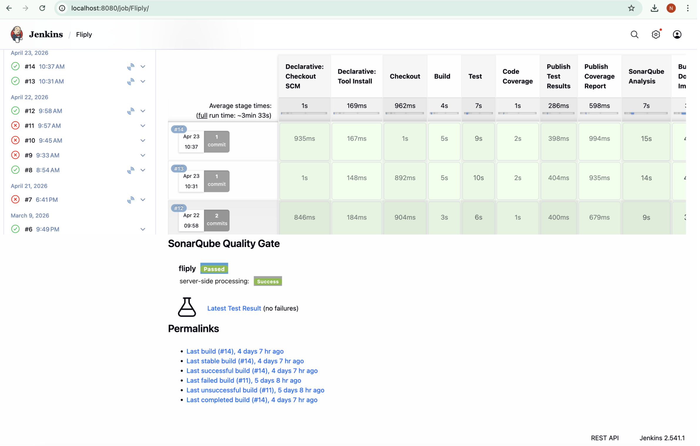
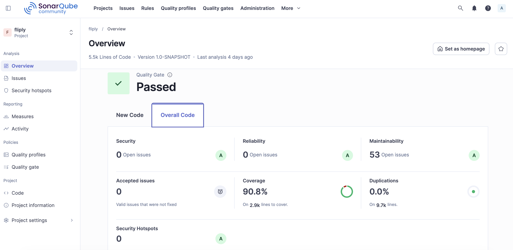

# Sprint Review Report

## Sprint Number & Dates
**Sprint 7**  
**Duration:** 2 weeks (15/04/2026 - 29/04/2026)
**Scrum Master:** Hoang Vu

## Sprint Goal
Sprint 7 ensures that your product is functional, usable, and aligned with the initial requirements defined by the Product Owner. Therefore, the focus of this sprint is on testing the functional and non functional features of the product.
 
## Completed User Stories / Tasks:
**Functional Task Details**
1. Test Plan Creation

- Created a complete test plan including test objectives, required resources, test environment configuration, and functional testing scope.

2. Final Unit Testing

- Executed final unit testing for all implemented features.
- Verified system functionality after code cleanup and refactoring.
- Ensured that all critical functionalities work as expected.

3. Bug Tracking and Issue Management

- Created a bug tracking table to record identified issues.
- Documented issue description, severity, status, and resolution.
- Fixed reported bugs and re-tested them to confirm successful resolution.

4. User Stories Review and Refinement

- Reviewed user stories in Trello related to the final system functionality.
- Updated and refined user stories to match implemented features.
- Ensured consistency between implementation, testing results, and documentation.

5. Static Code Analysis and CI/CD Execution

- Configured and executed Jenkins pipeline for project build.
- Deployed the application successfully using Docker.
- Generated SonarQube static code analysis reports.
- Verified that code quality metrics meet the required standards.

**Non-functional Task Details**

6. Heuristic Evaluation

- Conducted heuristic evaluation based on usability principles introduced in lectures.
- Evaluated usability aspects such as consistency, feedback, navigation, learnability, accessibility, and localization.
- Identified usability issues, classified them by severity, and documented suggested improvements.

7. User Acceptance Testing (UAT)

- Planned and executed User Acceptance Testing based on acceptance criteria defined in Sprint 6.
- Designed UAT test cases following the provided template.
- Executed test scenarios representing real user workflows and recorded pass/fail results.

8. Architecture and Technical Documentation Update

| Problem identified | How it was implemented | Technical change / recommendation | Impact | Test / verification |
|---|---|---|---|---|
| Teacher Create Class: empty class code | Trim input, block blank code, then call service duplicate check | Require class code and show a clear localized error message | Prevents invalid class creation and gives immediate feedback | Verify create-class with empty code and confirm the error is shown |
| Teacher Creates Flashcard Set: empty required fields | Validate subject/file first, then parse CSV, create set, import cards, reload class | Require subject and uploaded flashcard data | Avoids incomplete flashcard sets and improves input quality | Test submit with missing fields and confirm validation blocks it |
| Student Creates Flashcard: empty term or definition | Validate set, term, definition, and user before save; update existing card in EDIT mode | Reject empty Term/Definition values and show a warning before saving | Prevents incomplete flashcards from being stored | Try saving with empty term/definition and confirm it is rejected |
| Student Edit Flashcard: save changes stuck | Update `AppState.currentDetailList`, then return to the correct screen after save | Refresh the save flow so changes are applied and the user returns to flashcard details | Improves workflow stability and makes updates visible immediately | Edit a flashcard, save it, and verify the updated content appears |
| Student Delete Flashcard: missing confirmation | Ask for confirmation, delete quiz details first, then sync all flashcard lists | Add a confirmation dialog before deleting and show success/error feedback after the action | Reduces accidental deletion and improves safety | Trigger delete and confirm the confirmation dialog appears first |
| Student Create Quiz: invalid input | Validate empty, non-numeric, zero/negative, and too-large counts before service call | Validate empty, zero, negative, and too-large question counts against available flashcards | Prevents unexpected quiz generation and improves error handling | Test invalid inputs and verify the proper error message is shown |

**Conclusion:** There is **no major impact on system architecture**. The changes are limited to controller logic, validation, and localization resources, so the overall system architecture remains unchanged.
## Demo Summary
- Create test plan: [TestPlan.pdf](../Sprint%207/TestPlan.pdf)
- Display Jenkins and SonarQube: 
- Heuristic Evaluation:[Heuristic Evaluation Table.pdf](Heuristic%20Evaluation%20Table.pdf)
- User Acceptance Testing:[Test case.xlsx](Test%20case.xlsx)
## What Went Well
- Sprint 7 objectives were clearly defined, enabling the team to complete all planned testing, quality assurance, and documentation tasks on time.

- Functional, unit, and integration testing were executed effectively, and identified issues were resolved promptly, resulting in a stable final product.

- The CI/CD pipeline using Jenkins, SonarQube, and Docker worked reliably and supported continuous code quality improvement.

- Heuristic evaluation and User Acceptance Testing (UAT) were completed successfully, confirming that the system is usable and meets user expectations.

- Team collaboration and communication were smooth, allowing efficient task distribution and timely sprint completion.

## What Could Be Improved
- More automated test cases would improve testing coverage and reduce manual testing effort.

- Performance and security testing could be expanded to include more detailed scenarios for real-world usage.

- Time allocation for documentation could be improved by updating documents continuously instead of near the end of the sprint.

## Time Spent by Team Members

| Team Member  | view.Main Contributions                                                        | Time Spent (Hours) | In-class tasks |
|--------------|--------------------------------------------------------------------------------|--------------------|----------------|
| Ngoc Nguyen  | - Function and Non-function test task, Fix UT to increase code coverage        | 8                  | Submitted      |
| Thanh Nguyen | - Function and non-function test task, user acceptance test document(4,5,6)    | 8                  | Submitted      |
| Nhut Vo      | - Response for UT and fix duplicates, issues                                   | 8                  | Submitted      |
| Hoang Vu     | - Function and non-function test task, user acceptance test document(10,11,12) | 5                  | Submitted      |
| **Total**    |                                                                                | **2**              |                |
